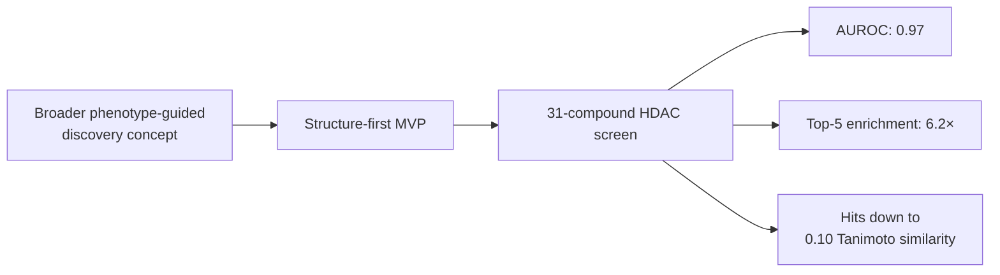

# PhenoFocus

**Research brief / implementation not included in this release**

A structure-first drug-discovery MVP within a broader phenotype-guided discovery concept.

Jiheon Kang leads a four-member team working on PhenoFocus. The project advanced to the competition main round. This brief records the scope and results reported in his CV, updated September 2026.

| Project | Details |
|---|---|
| Status | Ongoing · 2026–present |
| Role | Team Lead |
| Team | 4 members |
| Concept | Phenotype-guided drug discovery |
| Implemented project scope reported in the CV | Structure-first MVP |
| Competition milestone | Advanced to the main round |

## Research approach

The project developed a structure-first MVP to explore a broader phenotype-guided discovery concept. Initial results were obtained on a 31-compound HDAC screen.

The schematic describes the relationship between the project concept, MVP, and reported screen. It does not specify model architecture or experimental procedures beyond the CV.

## Reported results

All values below are scoped to the **31-compound HDAC screen**:

| Measure | Reported result |
|---|---:|
| AUROC | 0.97 |
| Top-5 enrichment | 6.2× |
| Tanimoto similarity of hits | As low as 0.10 |

These are results from a small, exploratory MVP. The structure-first MVP should remain distinct from the broader phenotype-guided discovery concept when describing the project. See [Evaluation scope](docs/evaluation-scope.md) for the interpretation limits supplied by the available evidence.

## Code availability

Implementation is not included in this release. This repository contains a research brief and evaluation-scope documentation; it does not contain executable discovery code, compound datasets, model weights, or experiment artifacts. The MVP described above is the project reported in the CV.

## 한국어 소개

강지헌이 4인 팀의 팀장으로 참여하는 신약 탐색 프로젝트입니다. 표현형 기반 신약 탐색이라는 큰 목표 아래 분자 구조를 먼저 활용하는 MVP를 개발했고, 대회 본선에 진출했습니다.

31개 화합물의 HDAC 스크린에서 AUROC 0.97, 상위 5개 농축도 6.2배, 히트의 Tanimoto 유사도 최저 0.10을 보고했습니다. 이 수치는 소규모 MVP 평가 범위의 결과입니다. 이 저장소는 연구 개요 문서로, 구현 코드는 이번 공개본에 포함하지 않습니다.

---

[Jiheon Kang's portfolio](https://heoneyzi.github.io/) · [GitHub](https://github.com/heoneyzi)
